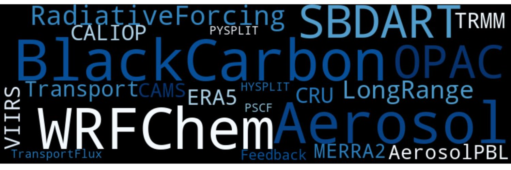

### Hi there 👋
My name is **Mukesh Rai**. I've been using programming for the data analysis and post-processing for the observation, satellite, reanalysis, and model data (mainly atmospheric aerosols data set). I would like to answer the scientific questions in the atmospheric science field using observation data, modeling, and satellite product.

- 🎓 *Masters in Science, Environment @ [CDES-TU, Nepal](http://www.cdes.edu.np/) 2013*
- 🎓 *Masters by Research, Glaciology @ [DESE-KU, Nepal](https://ese.ku.edu.np/) 2015*
- 🎓 *Doctorate in Science, Atmospheric modeling @ [UCAS, China](https://ic-en.ucas.ac.cn/) June, 2022*

## Languages and Tools:

 
#            
## Connect with me:
#

&nbsp;&nbsp;                       

&nbsp;&nbsp;

&nbsp;&nbsp;
