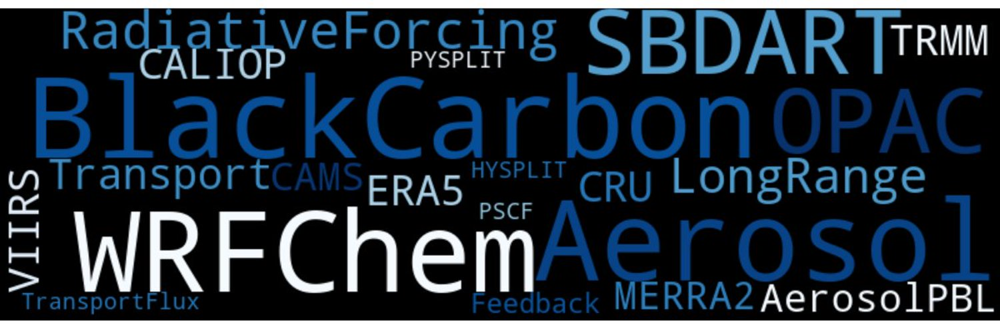
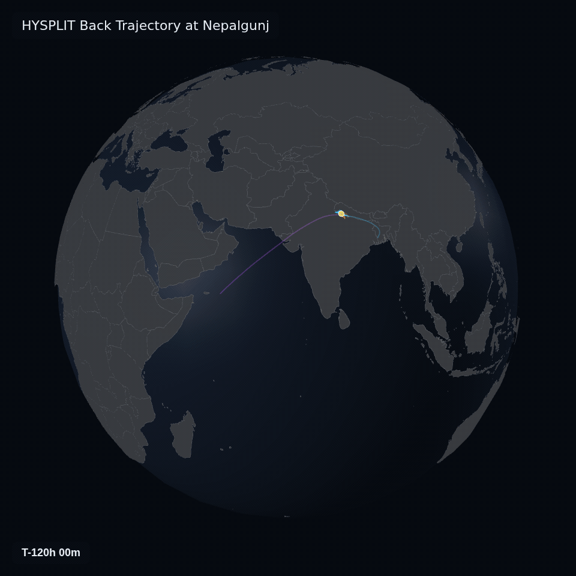

<!-- Banner -->

  
   
  <h1>👨‍🔬 Mukesh Rai</h1>
  
<strong>Atmospheric Science | Climate Data Analysis | Scientific Computing</strong>

  
  
  
  

---

## 🌍 About Me

I'm a climate and atmospheric scientist specializing in **data analysis, visualization, and modeling** of atmospheric phenomena. My work focuses on:

- 🔬 **Atmospheric Physics & Aerosol Science** - Understanding aerosol transport, optical properties, and climate impacts
- 📡 **Satellite & Reanalysis Data Processing** - Working with CAMS, ERA5, Sentinel-5P, and MERRA datasets
- 🌬️ **Trajectory Modeling** - HYSPLIT, FLEXPART, and atmospheric transport simulations
- 🌪️ **Climate & Weather Modeling** - WRF model post-processing and meteorological analysis
- 📊 **Data Visualization** - Creating publication-quality figures and interactive visualizations

---

## 🎓 Education

<table>
<tr>
  <td><strong>🎓 PhD in Science</strong></td>
  <td>Atmospheric Physics & Atmospheric Environment <a href="https://ic-en.ucas.ac.cn/">University of Chinese Academy of Sciences (UCAS)</a>, China <em>June 2022</em></td>
</tr>
<tr>
  <td><strong>🎓 Master's (Research)</strong></td>
  <td>Glaciology <a href="https://ese.ku.edu.np/">Kathmandu University (KU)</a>, Nepal <em>2015</em></td>
</tr>
<tr>
  <td><strong>🎓 Master's in Science</strong></td>
  <td>Environment <a href="http://www.cdes.edu.np/">Center for Development and Environment Studies (CDES-TU)</a>, Nepal <em>2013</em></td>
</tr>
</table>

---

## 🎨 Research Visualizations

  
<strong>Atmospheric Phenomena & Trajectory Simulations</strong>

  
  
  
  
  

---

## 💻 Languages & Tools

  <h4>Programming Languages</h4>
  
  
  
  
  
  
  <h4>Scientific Libraries & Tools</h4>
  

    <code>NumPy</code> • <code>Pandas</code> • <code>SciPy</code> • <code>Xarray</code> • <code>Matplotlib</code> • <code>Cartopy</code> • <code>Jupyter</code> • <code>NetCDF</code>
  

  
  <h4>Atmospheric Models & Software</h4>
  

    <code>WRF</code> • <code>HYSPLIT</code> • <code>FLEXPART</code> • <code>SMOKE</code> • <code>CAMS</code> • <code>ERA5</code> • <code>MERRA-2</code>
  

  
  <h4>Development Tools</h4>
  
  
  

---

## 📚 Featured Repositories

<table>
<tr>
  <td><a href="https://github.com/mukeshraeee/PySplit"><strong>🌬️ PySplit</strong></a></td>
  <td>Python package for HYSPLIT trajectory generation and visualization</td>
</tr>
<tr>
  <td><a href="https://github.com/mukeshraeee/IPART_Process"><strong>📡 IPART_Process</strong></a></td>
  <td>Tools for integrated aerosol transport processing and analysis</td>
</tr>
<tr>
  <td><a href="https://github.com/mukeshraeee/PostWRF"><strong>🌪️ PostWRF</strong></a></td>
  <td>Specialized visualization tools for WRF model outputs</td>
</tr>
<tr>
  <td><a href="https://github.com/mukeshraeee/Satellite-Reanalysis"><strong>🛰️ Satellite-Reanalysis</strong></a></td>
  <td>Scripts for downloading and processing satellite and reanalysis datasets</td>
</tr>
<tr>
  <td><a href="https://github.com/mukeshraeee/copernicus-training"><strong>🌍 Copernicus Training</strong></a></td>
  <td>Jupyter notebook tutorials for C3S and CAMS services</td>
</tr>
</table>

---

## 📊 GitHub Statistics

  
  

---

## 🤝 Connect With Me

  
  
  
  
  
  

---

## 🌟 Highlights

- 💡 Passionate about **open science** and **reproducible research**
- 🔍 Experienced with **large climate datasets** and **numerical modeling**
- 📖 Author of scientific publications in peer-reviewed journals
- 🎯 Dedicated to **mentoring** and **knowledge sharing** through tutorials and notebooks
- 🌱 Continuous learner exploring **machine learning** applications in climate science

---

  
<em>Exploring the atmosphere, one line of code at a time ☁️</em>

  
  ⭐ If you find my work useful, please consider starring my repositories! 
  
  

